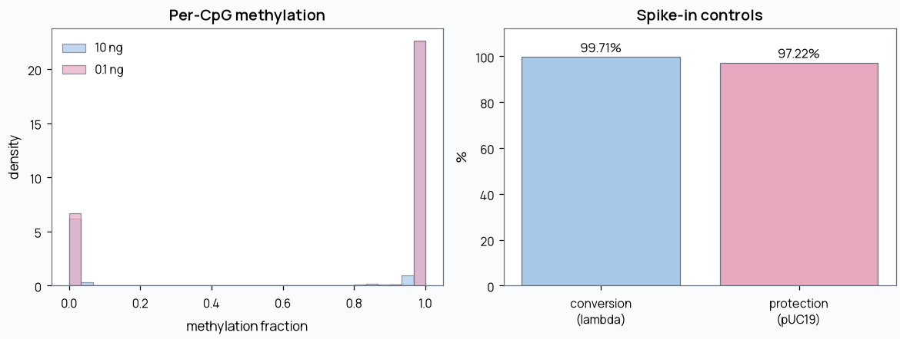
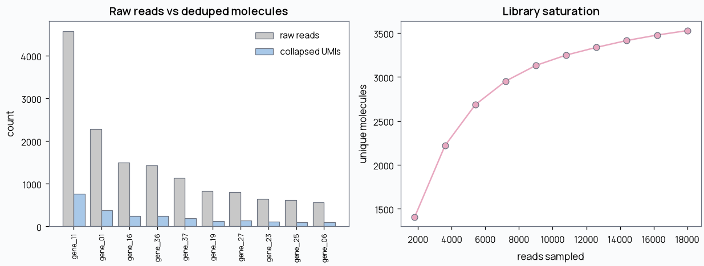
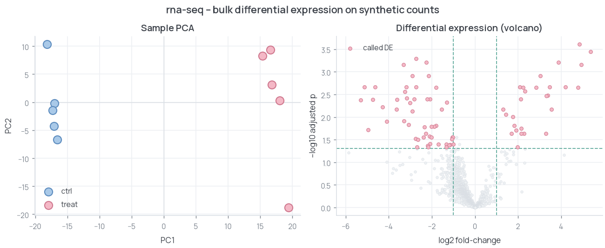
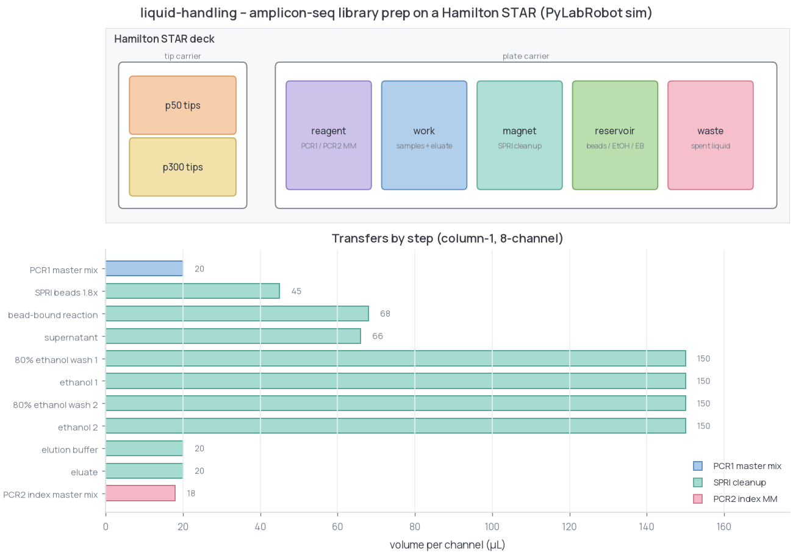
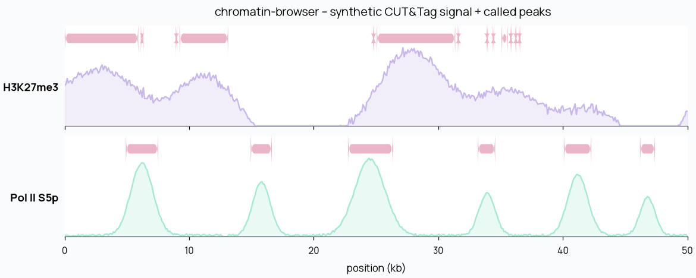

# omics-demos

Small, self-contained toy examples from an omics + lab-automation stack - sequencing
QC, single-cell/probe RNA, epigenomics, bulk RNA-seq, and Hamilton liquid handling.
Each demo runs in one command, uses only **synthetic data**, and shows exactly one idea.

Clean-room by design: no proprietary data or code - every dataset is generated on the fly.

## Quickstart

```bash
pip install -r requirements.txt
make all          # run every demo
# or one at a time:
make emseq        # EM-seq methylation QC
make umi          # UMI deduplication
make flex         # 10x Flex cell calling
make rna          # bulk RNA-seq differential expression
make liquid       # Hamilton STAR library prep (PyLabRobot sim)
make chromatin    # chromatin browser preview
```

Python 3.10+. `pylabrobot` (liquid) and `scipy` (rna) are the only demo-specific deps.

---

### emseq-methylation - EM-seq methylation QC
Conversion efficiency, CpG protection, coverage, and global methylation across a standard
(10 ng) and ultra-low (0.1 ng) input, using lambda/pUC19 spike-in controls.



[-> emseq-methylation/](emseq-methylation/)

---

### umi-dedup - UMI deduplication
Recovers true molecule counts from PCR-amplified, error-containing UMI reads with a
1-mismatch directional collapse; reports duplication rate and a saturation curve.



[-> umi-dedup/](umi-dedup/)

---

### flex-rna - 10x Flex cell calling
Knee-based cell calling and per-sample demultiplexing for a probe-based, multiplexed RNA
design, scored against ground truth.


[-> flex-rna/](flex-rna/)

---

### rna-seq - bulk differential expression
CPM normalization, PCA, and a Welch t-test with Benjamini-Hochberg FDR on a synthetic
two-condition count matrix, scored against a planted truth set of DE genes.



[-> rna-seq/](rna-seq/)

---

### liquid-handling - targeted PCR library prep on a Hamilton STAR
PCR1 master mix, SPRI bead cleanup, and PCR2 indexing, run column-by-column on a Hamilton
STAR deck via PyLabRobot's simulation backend - the full protocol executes and logs with
no hardware. Generic, illustrative volumes.



[-> liquid-handling/](liquid-handling/)

---

### chromatin-browser - interactive CUT&Tag track browser
A self-contained genome browser for H3K27me3 and Pol II S5p over a locus, with a live
crosshair readout and called peaks. Opens with no server.



[-> chromatin-browser/](chromatin-browser/)

---

## License

MIT - see [LICENSE](LICENSE).
