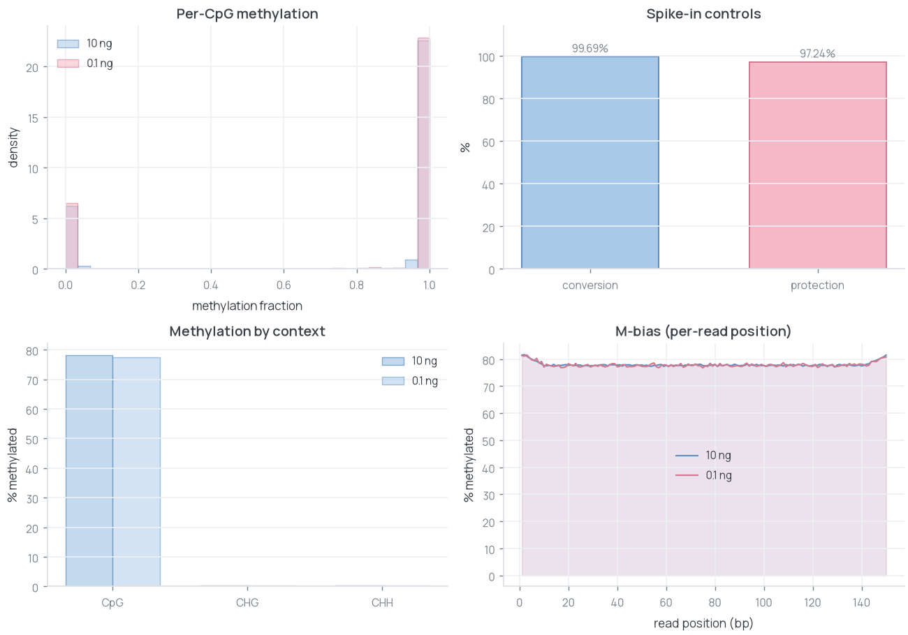
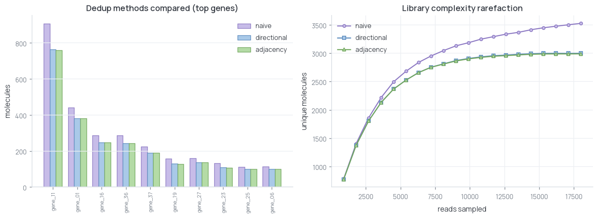
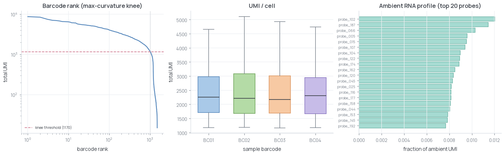

# omics-demos

Self-contained demonstrations of sequencing analysis and lab automation. Each
demo generates synthetic data, plants known ground truth, runs one method, and
scores the result.

The repository contains no proprietary data or code.

## Quickstart

```bash
pip install -r requirements.txt
make all

# Run one demo
make methylation
make scrna-umi
make scrna-cell-calling
make rna
make demux
make variant
make cnv
make pcr-enrichment
make chromatin
```

Python 3.10 or newer is recommended. PyLabRobot is used only by the
PCR-enrichment automation demo, and SciPy is used only by the bulk RNA-seq demo.

## Sequencing QC and analysis

### Methylation sequencing

Conversion efficiency, CpG protection, coverage, and global methylation across
standard and low-input synthetic libraries.



[Open the methylation-sequencing demo](methylation-sequencing/)

### scRNA-seq UMI deduplication

Directional and adjacency-based UMI collapse recover molecule counts from
duplicated, error-containing synthetic scRNA-seq reads.



[Open the scRNA-seq UMI demo](scrnaseq-umi-dedup/)

### scRNA-seq cell calling

Max-curvature knee calling separates cells from ambient barcodes in a synthetic
multiplexed, probe-based scRNA-seq count matrix.



[Open the scRNA-seq cell-calling demo](scrnaseq-cell-calling/)

### Bulk RNA-seq

CPM normalization, PCA, Welch's t-test, and false-discovery-rate correction on a
two-condition count matrix.


[Open the bulk RNA-seq demo](rna-seq/)

### Dual-index demultiplexing

Exact i7/i5 pair assignment and synthetic index-hopping measurement.


[Open the demultiplexing demo](demux-index-hopping/)

### Variant calling

Synthetic pileup, allele-fraction thresholding, and SNV precision/recall scoring.


[Open the variant-calling demo](variant-calling/)

### CNV and ploidy

GC-corrected coverage, rolling-median segmentation, and gain/loss calling.


[Open the CNV demo](cnv-ploidy/)

## Automation and interactive demos

### PCR enrichment automation

PCR enrichment, SPRI cleanup, and indexing on a simulated Hamilton STAR through
PyLabRobot. The executed transfers and exported worklist share one source plan.


[Open the PCR-enrichment automation demo](pcr-enrichment-automation/)

### Chromatin browser

An interactive CUT&Tag track browser over a synthetic locus with threshold-based
peak calling.


[Open the chromatin-browser demo](chromatin-browser/)

## License

MIT; see [LICENSE](LICENSE).
