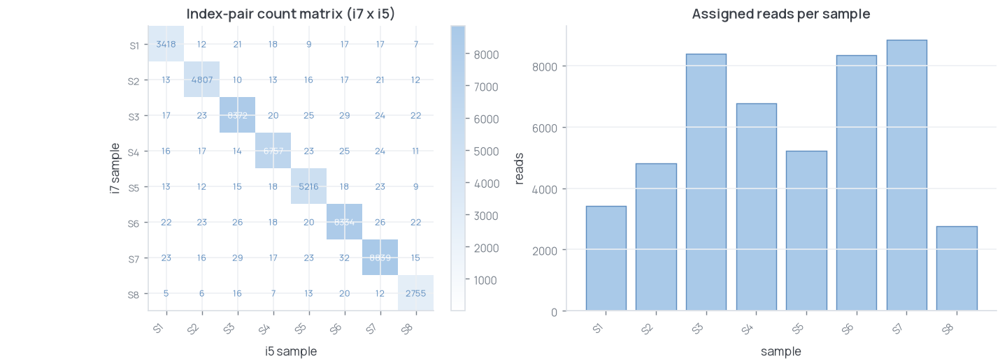
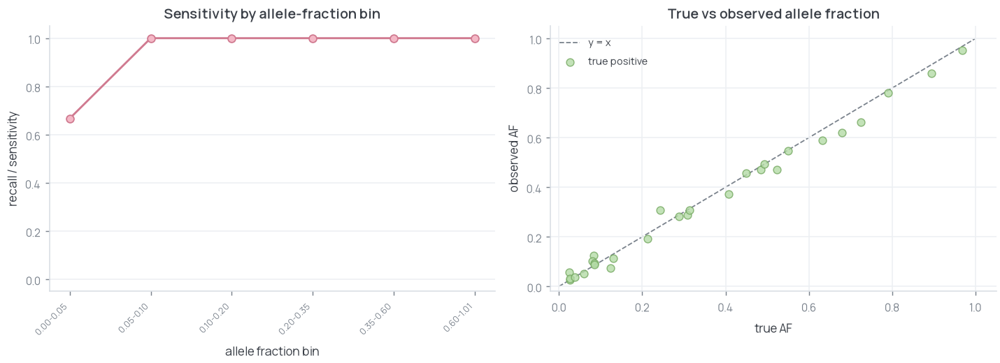
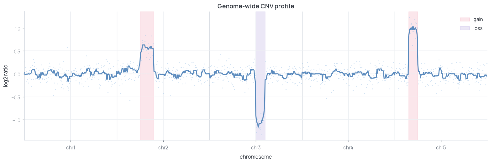

# omics-demos

Self-contained demos from an omics and lab-automation stack. Each demo runs in
one command, generates its own synthetic data, and shows exactly one idea.
Each demo plants known ground truth, runs the method blind, and scores how well
it recovers it.

Clean-room by design: no proprietary data or code - every dataset is generated on the fly.

## Quickstart

```bash
pip install -r requirements.txt
make all          # run every demo
# or one at a time:
make emseq        # EM-seq methylation QC
make umi          # UMI deduplication
make flex         # 10x Flex cell calling
make rna          # bulk RNA-seq differential expression
make demux        # dual-index demux + index hopping
make variant      # SNV calling with precision/recall
make cnv          # coverage-based CNV / ploidy calling
make liquid       # Hamilton STAR library prep (PyLabRobot sim)
make chromatin    # chromatin browser preview
```

Python 3.10+. `pylabrobot` (liquid) and `scipy` (rna) are the only demo-specific deps.

---

## Sequencing QC & analysis

### emseq-methylation - EM-seq methylation QC
Conversion efficiency, CpG protection, and global methylation across standard (10 ng)
and ultra-low (0.1 ng) inputs using lambda/pUC19 spike-in controls. Recovered mCpG
0.782 vs planted 0.78; conversion 99.69%.


[-> emseq-methylation/](emseq-methylation/)

---

### umi-dedup - UMI deduplication
1-mismatch directional collapse recovers 2,999 molecules from 18,000 reads (truth:
3,000). Naive counting overcounts at 3,528 because sequencing errors mint false UMIs.


[-> umi-dedup/](umi-dedup/)

---

### flex-rna - 10x Flex cell calling
Max-curvature knee calling on a multiplexed probe-based library. Calls 1,014 cells
with 0 false positives and 186 missed low-UMI cells out of 1,200 true cells.


[-> flex-rna/](flex-rna/)

---

### rna-seq - bulk differential expression
CPM normalization, PCA, and Welch t-test with BH FDR on a two-condition count matrix.
Recovers 57.5% of 120 planted DE genes at 88.5% precision, 100% sign agreement.


[-> rna-seq/](rna-seq/)

---

### demux-index-hopping - dual-index demultiplexing + index hopping
Assigns reads by exact i7/i5 index-pair match and quantifies hopping from off-diagonal
counts. Estimated hopping rate 2.00%, matching the injected 2%.



[-> demux-index-hopping/](demux-index-hopping/)

---

### variant-calling - SNV calling with precision/recall vs truth
Piles up reads, calls SNVs above an allele-fraction threshold, and scores against 30
planted variants. Precision 0.74, recall 0.93 overall; sensitivity drops to 0.67 below
5% AF.



[-> variant-calling/](variant-calling/)

---

### cnv-ploidy - coverage-based CNV / ploidy calling
GC-corrected coverage, rolling-median segmentation, threshold-based gain/loss calling.
All 3 planted CNVs (chr2 gain 1.5x, chr3 loss 0.5x, chr5 gain 2.0x) recovered exactly.



[-> cnv-ploidy/](cnv-ploidy/)

---

## Automation & interactive

### liquid-handling - targeted PCR library prep on a Hamilton STAR
PCR1 master mix, SPRI bead cleanup, and PCR2 indexing on a Hamilton STAR deck via
PyLabRobot's simulation backend - no hardware. Worklist matches plan: 11/11 transfers,
857/857 uL, PASS.


[-> liquid-handling/](liquid-handling/)

---

### chromatin-browser - interactive CUT&Tag track browser
H3K27me3 and Pol II S5p signal over a synthetic locus with threshold-based peak calling.
Pol II peaks recover 6/6 planted promoter positions. Opens in any browser, no server.


[-> chromatin-browser/](chromatin-browser/)

---

## License

MIT - see [LICENSE](LICENSE).
