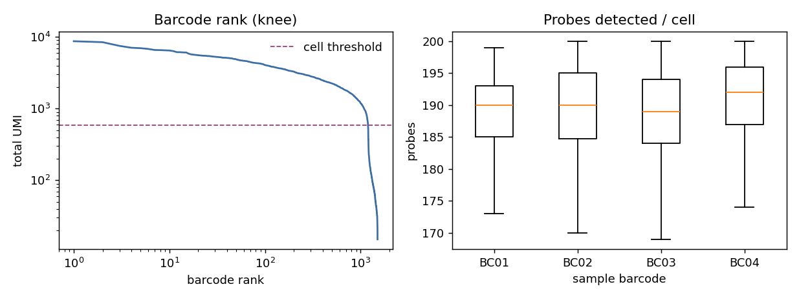

# flex-rna

Probe-based, multiplexed RNA profiling QC - cell calling and per-sample demultiplexing
for a 10x Flex-style design.

> **Assumption:** `flex-demos` here is read as **10x Genomics Flex**. If it means something
> else, swap the data model - the QC pattern is the same.

All data is synthetic - no real counts.

## Run

```bash
# from the repo root
pip install -r requirements.txt
make flex
```

## What it does

- Simulates probe UMI counts for 4 samples multiplexed by probe barcode, plus empty/ambient barcodes.
- Calls cells with a knee-style UMI threshold and scores the call against ground truth.
- Reports per-sample cell count, median UMIs, and median probes detected.

## Example output

```
UMI threshold for cell call: 584
Called cells: 1192   (true cells kept 1191, empties admitted 1, cells lost 9)

Per-sample (called cells):
           cells  median_umi  median_probes
BC01         298      1974.5          190.0
BC02         296      2017.0          190.0
BC03         299      1987.0          189.0
BC04         299      2146.0          192.0
```



## How it works

Cell calling via max-curvature on the log-log barcode-rank curve (from `analyze.py`):

```python
def find_knee(ranked_umis):
    n = len(ranked_umis)
    x = np.log10(np.arange(1, n + 1))
    y = np.log10(ranked_umis.clip(min=1))
    win = max(5, n // 50)
    y_smooth = np.convolve(y, np.ones(win) / win, mode="same")
    # discrete curvature: |y''| / (1 + y'^2)^(3/2)
    dy = np.gradient(y_smooth, x)
    ddy = np.gradient(dy, x)
    curvature = np.abs(ddy) / (1 + dy ** 2) ** 1.5
    margin = max(10, n // 20)
    curvature[:margin] = 0
    curvature[-margin:] = 0
    knee_idx = np.argmax(curvature)
    return knee_idx, ranked_umis[knee_idx]
```

Returns the rank and UMI count at the knee point. Barcodes above this threshold are called as cells.

## Files

```
generate_data.py   simulate multiplexed probe counts + empty barcodes
analyze.py         knee-based cell calling, demux, per-sample QC
plots.py           barcode-rank (knee) + probes-per-cell by sample
```
