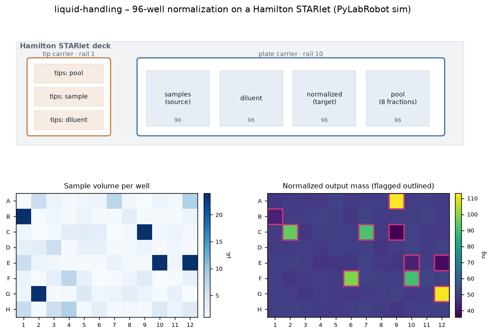

# liquid-handling

A realistic DNA normalization run on a Hamilton STARlet, driven by **PyLabRobot** in
simulation (chatterbox) mode - the whole protocol executes and logs every deck action
with **no hardware**. This is the automation layer the rest of the omics stack sits on:
you hand it a plate of quantified samples, it gives you a normalized plate, a pooled
library, and a worklist.

All data is synthetic - no real samples.

## Run

```bash
# from the repo root
pip install -r requirements.txt   # includes pylabrobot
make liquid
```

## What it does

A full 96-well plate, 12 columns, 8-channel head:

1. **Normalize** - computes per-well sample + diluent volumes to hit a target mass at a
   fixed final volume, then transfers them. Diluent (water) reuses one tip set; sample
   transfers take fresh tips per column so there's no carryover.
2. **Edge handling** - wells too dilute to reach the target are capped and flagged
   (`dilute`); wells so concentrated they'd need a sub-microliter transfer are floored to
   the minimum pipetting volume and flagged (`min_vol`). Everything else is `ok`.
3. **Row-pool** - pulls a fixed volume from every normalized well into 8 pooled fractions.

It writes a transfer **worklist** (`worklist.csv`), a per-well **report**
(`normalization_report.tsv`), and the full **deck action log** (`deck_actions.log`).

## Example output

```
=== Hamilton STARlet normalization + row-pool (synthetic, chatterbox sim) ===
plate: 96 wells, 12 columns, 8-channel head
target 50 ng in 25 uL   |   pool 5 uL/well -> 8 row fractions
well status: dilute=4, min_vol=6, ok=86
on-target wells: output mass 49.9 ng, CV 1.8%
tips used: 200   |   total volume moved: 2880 uL   |   deck actions logged: 1221 lines

flagged wells (10):
well  conc_ng_ul  sample_ul  out_mass_ng  status
  B1         1.8       24.0         43.2  dilute
  A9       113.2        1.0        113.2 min_vol
  ...
```

86 of 96 wells land on target at 1.8% CV; the 10 flagged wells are the deliberately
dilute and over-concentrated ones. To run on a real instrument, swap
`LiquidHandlerChatterboxBackend` for the STAR backend - the protocol is unchanged.



## Files

```
generate_data.py   synthesize a 96-well plate of concentrations (with edge cases)
normalize.py       plan + edge handling + execute normalization & row-pool (chatterbox)
plots.py           STARlet deck map + per-well volume and output-mass heatmaps
```

## Outputs

```
data/worklist.csv                 per-transfer worklist (step, source, dest, volume)
data/normalization_report.tsv     per-well conc, volumes, output mass, status
data/deck_actions.log             every simulated deck action
assets/normalization_qc.png       deck map + plate heatmaps
```
