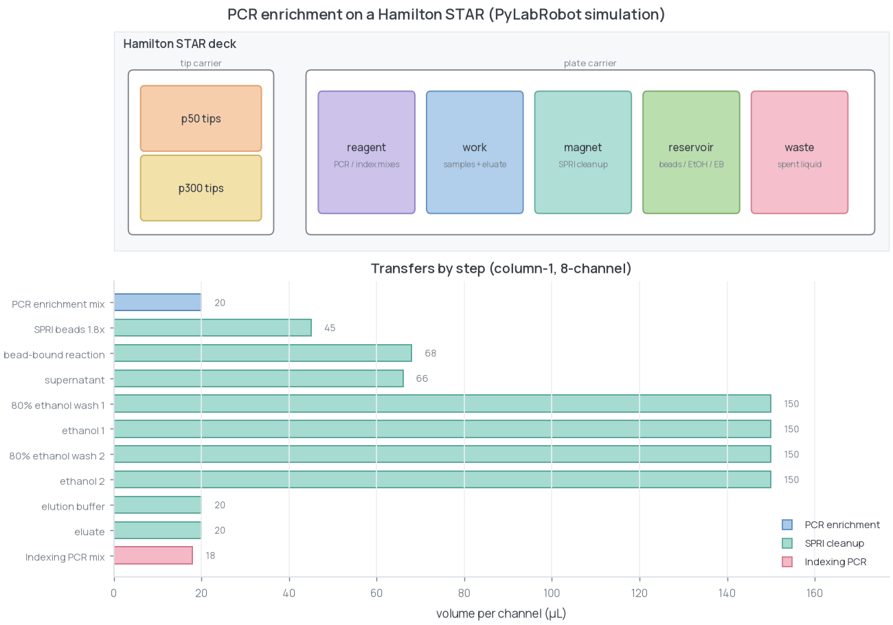

# PCR-enrichment automation

PCR enrichment, SPRI cleanup, and indexing on a Hamilton STAR through
PyLabRobot's simulation backend. The run logs every deck action without
requiring hardware.

The volumes and deck layout are generic and illustrative, not a validated
method. All sample data is synthetic.

## Run

```bash
pip install -r requirements.txt
make pcr-enrichment
```

## Workflow

1. Distribute a PCR-enrichment master mix to one sample column.
2. Perform SPRI binding, magnetic separation, two ethanol washes, and elution.
3. Add an indexing-PCR master mix to the cleaned product.

A single transfer plan drives both execution and worklist export, preventing the
two representations from drifting. Fresh tips are used for every transfer.

```text
=== Hamilton STAR PCR enrichment (synthetic simulation) ===
mode: DRY / simulated | column 1 | 8 channels | 3 phases
```



## Files

```text
generate_data.py   synthetic eight-sample sheet with generic dual indexes
run_protocol.py    transfer plan, simulated execution, and worklist export
plots.py           deck map and transfer-volume chart
```

## Outputs

```text
data/worklist.csv
data/protocol_summary.tsv
data/deck_actions.log
assets/pcr_enrichment_qc.png
```

For hardware execution, replace the simulation backend with the appropriate
PyLabRobot backend and add locally validated confirmations.
