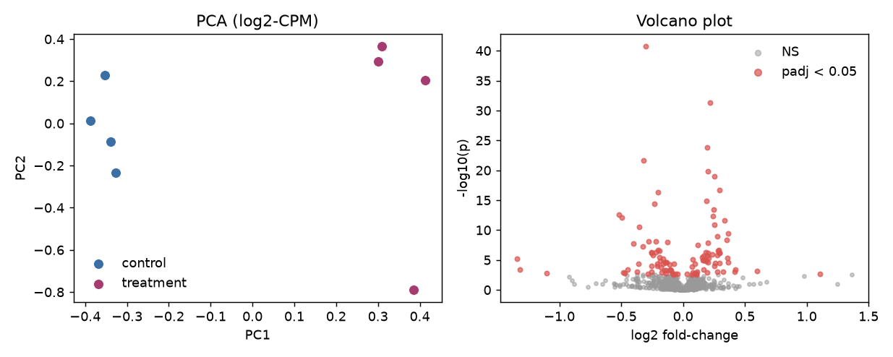

# rna-seq

Bulk/single-blastocyst RNA-seq mini-pipeline on synthetic counts: normalize,
PCA, per-gene differential expression testing with multiple-testing correction.

All data is synthetic - no real counts.

## Run

```bash
# from the repo root
pip install -r requirements.txt
make rna
```

## What it does

- Generates a gene x sample count matrix (2000 genes, 2 conditions x 4 replicates) with 80 planted DE genes (40 up, 40 down at 3x fold-change).
- CPM-normalizes and log2-transforms counts, then runs PCA to check condition separation.
- Runs a per-gene Welch t-test with Benjamini-Hochberg correction and reports how many planted DE genes are recovered.

## Example output

```
PC1 explains 21.5%, PC2 explains 14.6%
Significant genes (padj < 0.05): 107
Planted DE genes: 80
Recovered: 61 / 80 (76%)
False positives: 46
```



## Files

```
generate_data.py   synthesize gene x sample count matrix with planted DE
analyze.py         CPM normalize, PCA, Welch t-test + BH correction
plots.py           PCA scatter + volcano plot
```
